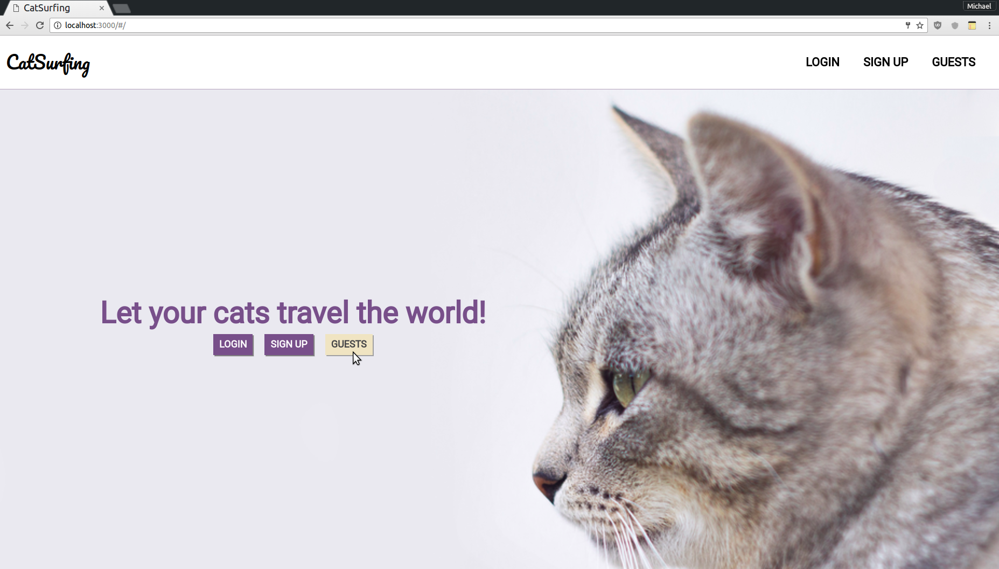
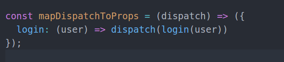
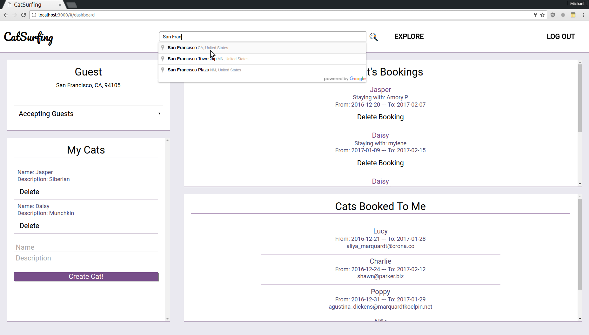
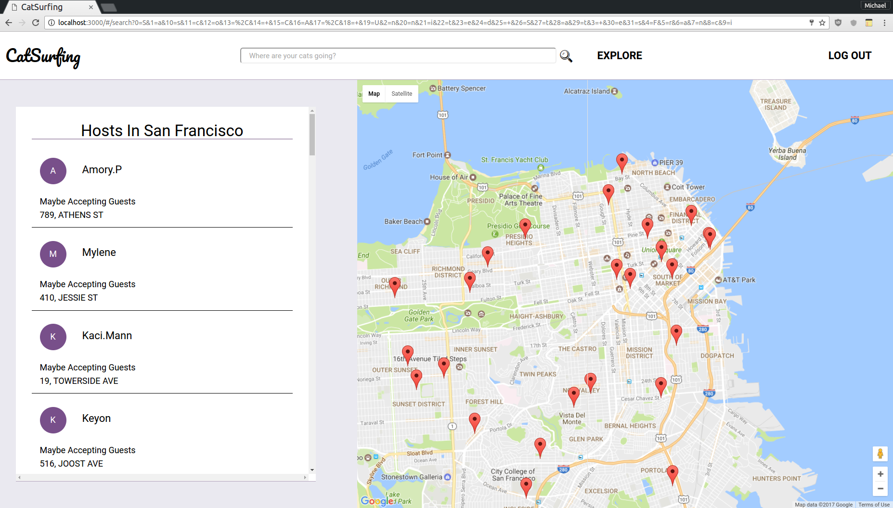
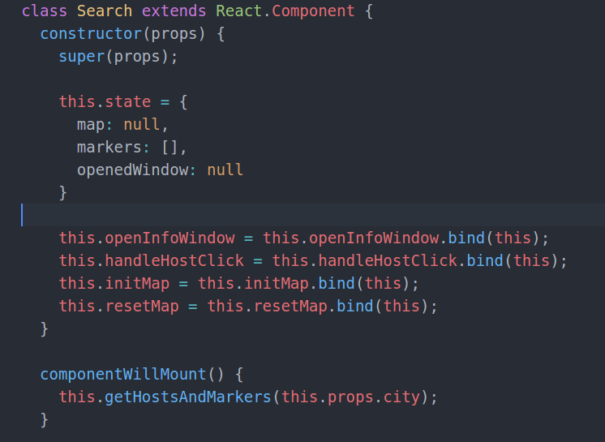
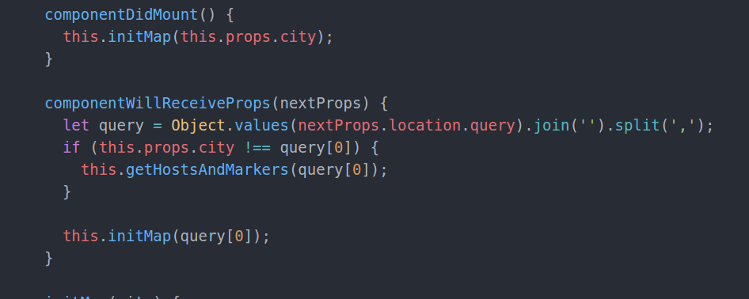
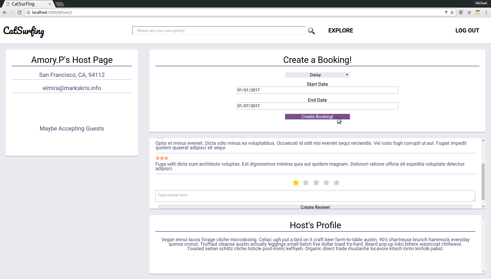
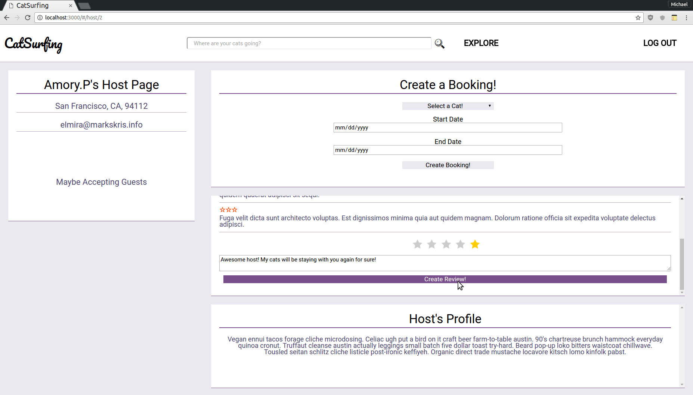

# CatSurfing

[CatSurfing](http://www.catsurfing.club) is a website that allows users to let their cats go on vacation.

## Features & Implementation

### Guest Sign In

Pass in login dispatch function to props.

Set onClick listener on Guest button to call handleGuest.

Visitors can easily demo the site through a guest account button. This button sets the form state to the credentials of a demo account and logs the guest in.

### Search and Google Maps

Store map, markers and infowindows to reduce redundancy.

Add checks to fix bug where map would list and map would not reload when pressing the back button on browser.

Visitors can use the search bar to search for hosts in a specific location. Search bar will auto complete to valid addresses.

### Bookings

Visitors can book their cats to a host. Validations are in place to ensure a cat is selected and the dates are not conflicting.

### Reviews

Visitors can write reviews to a host. The current user can only write one review to the host.

### Single page

CatSurfing is a single page app that allows for quick navigation between its various components. As data is fetched from Rails, components are only updated when necessary.

## Future Directions for the Project

Given more time, I would like to implement the following:

### User Profiles

Users can write and edit their own profiles.

### Messaging

Users can communicate with other users within the app.
